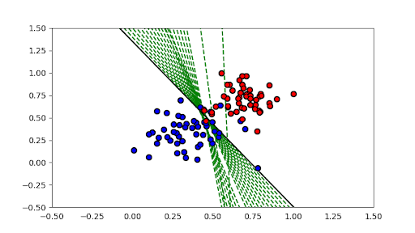

# Introduction to Neural Networks

## Classes:

### 8. Perceptrons as Logical Operators

```python
# AND PERCEPTRON
weight1 = 1.0
weight2 = 1.0
bias = -1.5
```

```python
# NOT PERCEPTRON
weight1 = 0.0
weight2 = -1.0
bias = 0.0
```

### 9. Perceptron Trick

```python
import numpy as np

# INPUT DATA
x = np.array([1., 1.]).reshape(-1, 1)

# WEIGHTS
w = np.array([3., 4.]).reshape(1, -1)
b = np.array([-10.]).reshape(1,1)

# OUTPUT
out = w.dot(x) + b

learn_rate = 0.1 #learning rate
t = 0  # counter
eps = -1e-10 # small value ==> equivalent to 0
print("{}º iteration: w = {}, b = {}, output = {}".format(t, w, b, out))

# WHILE OUTPUT SMALLER THAN 0
while out < eps:
    # UPDATE WEIGHTS
    w += x.T * learn_rate
    b += learn_rate
    
    # OUTPUT
    out = w.dot(x) + b
    
    # INCREASE COUNTER
    t += 1
    
    print("{}º iteration: w = {}, b = {}, output = {}".format(t, w, b, out))
    
print("\nNum of iterations = " + str(t))
```

**OUTPUT:**
`0º iteration: w = [[3. 4.]], b = [[-10.]], output = [[-3.]]`
`1º iteration: w = [[3.1 4.1]], b = [[-9.9]], output = [[-2.7]]`
`2º iteration: w = [[3.2 4.2]], b = [[-9.8]], output = [[-2.4]]`
`3º iteration: w = [[3.3 4.3]], b = [[-9.7]], output = [[-2.1]]`
`4º iteration: w = [[3.4 4.4]], b = [[-9.6]], output = [[-1.8]]`
`5º iteration: w = [[3.5 4.5]], b = [[-9.5]], output = [[-1.5]]`
`6º iteration: w = [[3.6 4.6]], b = [[-9.4]], output = [[-1.2]]`
`7º iteration: w = [[3.7 4.7]], b = [[-9.3]], output = [[-0.9]]`
`8º iteration: w = [[3.8 4.8]], b = [[-9.2]], output = [[-0.6]]`
`9º iteration: w = [[3.9 4.9]], b = [[-9.1]], output = [[-0.3]]`
`10º iteration: w = [[4. 5.]], b = [[-9.]], output = [[-7.10542736e-15]]`

`Num of iterations = 10`

### 10. Perceptron Algorithm

```python
def perceptronStep(X, y, W, b, learn_rate = 0.01):
    # Fill in code
    for xi, yi in zip(X, y):
        yhat = prediction(xi, W, b)

        if yi - yhat == 1:
            W[0] += xi[0] * learn_rate
            W[1] += xi[1] * learn_rate
            b += learn_rate

        elif yi - yhat == -1:
            W[0] -= xi[0] * learn_rate
            W[1] -= xi[1] * learn_rate
            b -= learn_rate
        
    return W, b
```

**OUTPUT:**


### 14. Discrete vs Continuous

```python
import numpy as np

# SCORE FUNCTION
score = lambda x : 4*x[0] + 5*x[1] - 9

# SIGMOID FUNCTION
sigmoid = lambda x : 1. / (1 + np.exp(-x))

# OPTIONS:
points = [(1,1), (2,4), (5,-5), (-4,5)]

for p in points:
    
    # IF PROBABILITY IS 50% OF BEING RED OR BLUE
    if sigmoid(score(p)) == 0.5:
        print("The point {} has exactly a 50% probability of being red or blue!".format(p))
```

**OUTPUT:**
`The point (1, 1) has exactly a 50% probability of being red or blue!`
`The point (-4, 5) has exactly a 50% probability of being red or blue!`

### 20. Cross-Entropy 2

```python
import numpy as np

# Write a function that takes as input two lists Y, P,
# and returns the float corresponding to their cross-entropy.
def cross_entropy(Y, P):
    y = np.array(Y)
    p = np.array(P)

    return - np.sum(y * np.log(p) + (1-y) * np.log(1-p))
```

### 26. Gradient Descent

> [Notebook](GradientDescent.ipynb)